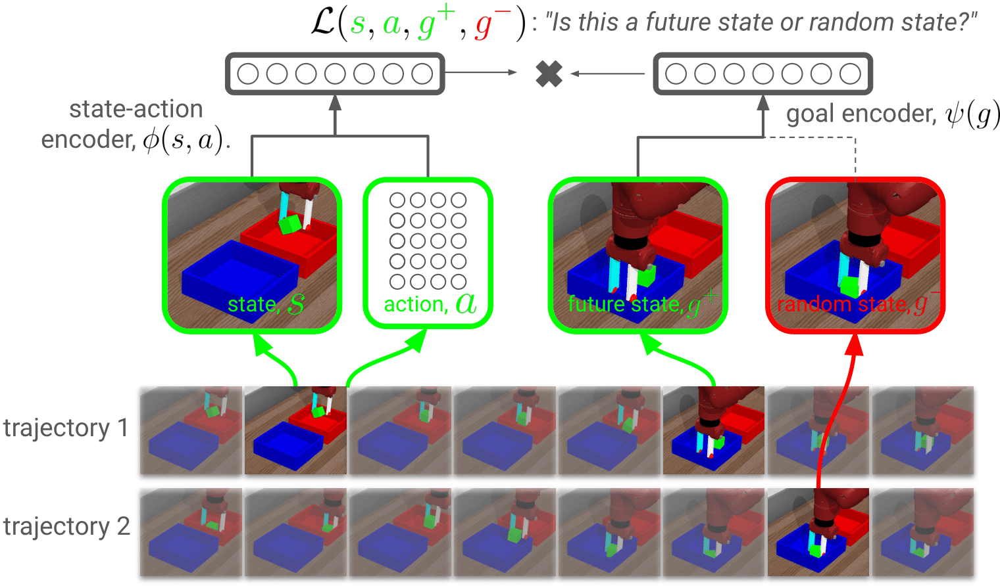

# Contrastive Example-Based Control

<p align="center"> Kyle Hatch, &nbsp; Benjamin Eysenbach, &nbsp; Rafael Rafailov &nbsp; Tianhe Yu &nbsp; Ruslan Salakhutdinov &nbsp; Sergey Levine &nbsp; Chelsea Finn </p>
<p align="center">
   <a href="https://openreview.net/pdf?id=QFmjXoxyLR">paper</a>
</p>
<!--  -->

*Abstract*: While there are many real-world problems that might benefit from reinforcement learning, these problems rarely fit into the MDP mold: interacting with the environment is often prohibitively expensive and specifying reward functions is challenging. Motivated by these challenges, prior work has developed data-driven approaches that learn entirely from samples from the transition dynamics and examples of high-return states. These methods typically learn a reward function from the high-return states, use that reward function to label the transitions, and then apply an offline RL algorithm to these transitions. While these methods can achieve good results on many tasks, they can be complex, carefully regularizing the reward function and using temporal difference updates. In this paper, we propose a simple and scalable approach to offline example-based control. Unlike prior approaches (e.g., ORIL, VICE, PURL) that learn a reward function, our method will learn an implicit model of multi-step transitions. We show that this implicit model can represent the Q-values for the example-based control problem. Thus, whereas a learned reward function must be combined with an RL algorithm to determine good actions, our model can directly be used to determine these good actions. Across a range of state-based and image-based offline control tasks, we find that our method outperforms baselines that use learned reward functions, and additional experiments demonstrate improved robustness and scaling with dataset size.

This repository contains the new algorithms, the baselines, and the associated environments used in this paper. If you use this repository, please consider adding the following citation:

```
@article{hatch2022laeo,
  title={Contrastive Example-Based Control},
  author={Hatch, Kyle and Eysenbach, Benjamin and Rafailov, Rafael and Yu, Tianhe and Salakhutdinov, Ruslan and Levine, Sergey and Finn, Chelsea},
  year={2022}
}
```

### Installation

1. Create an Anaconda environment: `conda create -n laeo python=3.9
   -y`
2. Activate the environment: `conda activate laeo`
3. Install the dependencies: `pip install -r requirements.txt --no-deps`
<!-- 4. Check that the installation worked: `./run.sh` -->

<!-- ### Running the experiments

To check that the installation has completed, run `./run.sh` to perform training for just a handful of steps. To replicate the results from the paper, please run:
```python lp_contrastive.py```

Check out the `lp_contrastive.py` file for more information on how to select different algorithms and environments. For example, to try the offline RL experiments, set `env_name = 'offline_ant_umaze'`. One important note is that the image-based experiments should be run using multiprocessing, to avoid OpenGL context errors:
```python lp_contrastive.py --lp_launch_type=local_mp``` -->


### Questions?
If you have any questions, comments, or suggestions, please reach out to Kyle Hatch (khatch@stanford.edu).
